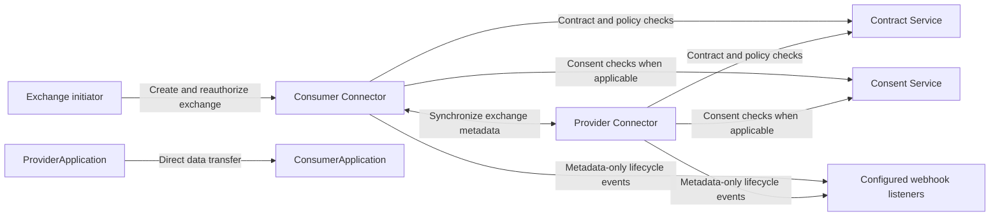
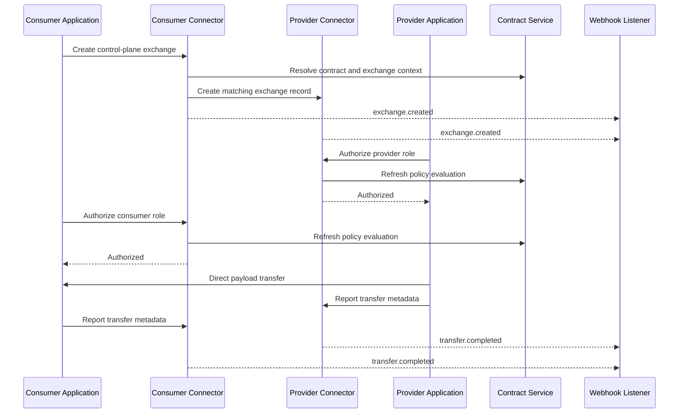
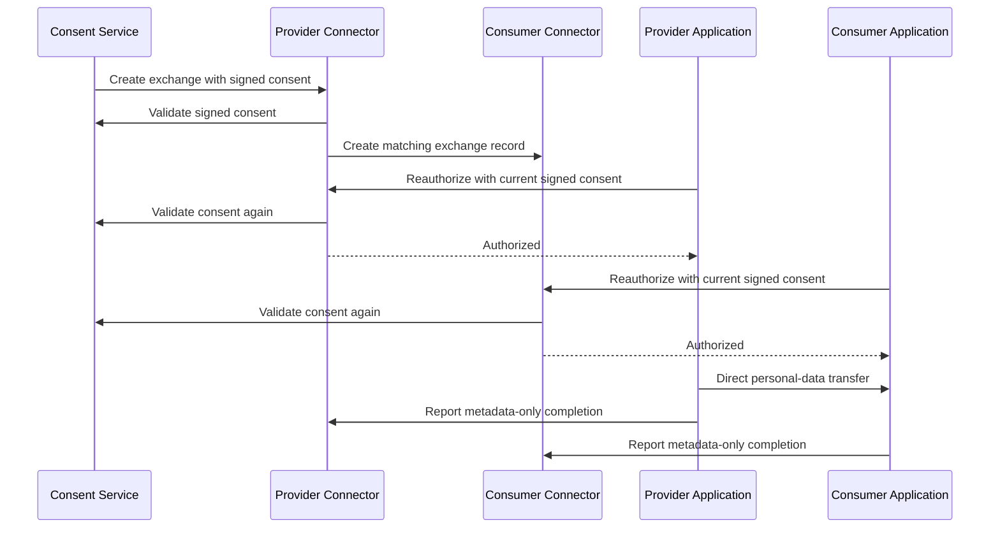

# Control Plane and Data Plane Separation

The connector can run a control-plane-only workflow alongside its established embedded data exchange workflow. In the control-plane workflow, the connector validates contracts, policies, and consent, while the provider and consumer applications transfer data directly between themselves.

The workflow is disabled by default. Existing `/exchange`, `/consumer/exchange`, `/provider/*`, `/data/*`, and `/consent/*` endpoints retain their embedded behavior and continue to move data through the connector.

## Operational Boundary



The line between participant applications is the data plane. The connector does not proxy, inspect, persist, or forward that payload. All other calls shown are control-plane operations or metadata-only lifecycle notifications.

## Enable the Workflow

Set the following fields in `src/config.json` or through the connector configuration API:

```json
{
    "controlPlaneEnabled": true,
    "controlPlaneWebhookUrls": ["https://operations.example/events"]
}
```

`controlPlaneWebhookUrls` is optional. Each URL receives best-effort lifecycle events. A trigger request can add a per-exchange HTTPS `callbackUrl`; it is combined with the configured listeners and duplicate URLs receive one event.

## What Is Covered

-   Bilateral B2B exchanges created through `POST /controlplane/exchanges`.
-   Ecosystem or project exchanges created through the same endpoint with `contract`, `resourceId`, and `purposeId`.
-   Consent-driven exchanges created through `POST /controlplane/consent/exchanges`.
-   Provider and consumer policy reauthorization immediately before direct transfer.
-   Fresh signed-consent validation during reauthorization for consent exchanges.
-   Metadata-only transfer completion and failure reporting.
-   Optional best-effort lifecycle webhooks.

## Not Yet Covered

-   Service-chain execution and infrastructure-node orchestration.
-   Proxying, fetching, or forwarding business data through the connector.
-   Connector-issued exchange tokens, mTLS, and signed participant requests.
-   Reliable webhook delivery, retries, or a durable event queue.
-   Payload storage, payload audit logs, or connector verification that participant applications actually received raw data.

## API Workflow

All control-plane endpoints require the established Bearer JWT authentication. The workflow returns `404` while disabled.

External orchestration systems can create bilateral or ecosystem exchanges through `POST /controlplane/exchanges/external/trigger`. This endpoint accepts the same request body as the authenticated trigger and requires the `x-exchange-trigger-api-key` header. It uses the existing `EXCHANGE_TRIGGER_API_KEY` configuration.

The connector validates external-trigger API keys before validating the exchange request body. This avoids passing unauthenticated requests into contract or catalog processing.

### 1. Create an Exchange

For bilateral and ecosystem exchanges, call `POST /controlplane/exchanges`. The request fields match the existing exchange trigger fields, without `data` or direct-response options.

```json
{
    "contract": "https://contract.example/contracts/contract-id",
    "resourceId": "https://catalog.example/serviceofferings/provider-offering",
    "purposeId": "https://catalog.example/serviceofferings/consumer-offering",
    "resources": [
        {
            "resource": "https://catalog.example/dataresources/customer-records"
        }
    ],
    "callbackUrl": "https://consumer.example/control-plane-events"
}
```

The connector creates and synchronizes a `DataExchange` record, resolves participant endpoints, and returns the exchange context. It does not call provider data resources or consumer receiving resources.

For consent exchanges, call `POST /controlplane/consent/exchanges` with `signedConsent`, `encrypted`, and an optional `callbackUrl`. The signed-consent material is used for validation and is not persisted in the exchange record.

### 2. Reauthorize Before Transfer

Immediately before transferring data, each participant asks its own connector to authorize its role:

```json
{
    "participant": "provider"
}
```

Send the request to `POST /controlplane/exchanges/{id}/authorize`. The provider checks data resources; the consumer checks purpose resources. Both checks retrieve current policy state. Consent exchanges must include the fresh `signedConsent` and `encrypted` fields, and the consent ID must match the exchange record.

A `200` response has `content.authorized: true`. A policy denial or expired authorization returns `403`. An exchange created by another workflow or a missing exchange returns `404`.

### 3. Transfer Directly

After both checks succeed, the provider application sends data directly to the consumer application using the participant-owned transport and authentication method. The connector does not define the payload protocol or receive the payload.

Participants can use the existing `x-ptx-dataExchangeId`, `x-ptx-contractId`, and `x-ptx-contractURL` headers as correlation context. Do not send connector credentials, signed consent, or user tokens to the peer application unless the participant-to-participant protocol explicitly requires and protects them.

### 4. Report Completion

Each participant reports its view of the transfer through `POST /controlplane/exchanges/{id}/transfer`.

```json
{
    "participant": "provider",
    "success": true,
    "metadata": {
        "checksum": "sha256:example",
        "mimetype": "application/json",
        "size": 1024
    }
}
```

The report requires a successful authorization for that participant. It stores and synchronizes only the status, timestamp, checksum, MIME type, and size. It must not contain raw business data.

### 5. Read Exchange Status

Call `GET /controlplane/exchanges/{id}` to retrieve the current control-plane exchange state. The response contains participant endpoints, contract reference, authorization timestamps, lifecycle status, and metadata-only transfer information. It does not expose raw data, participant representation credentials, signed consent material, or connector tokens.

## Example Journeys

### Bilateral Data Delivery

1. The consumer creates a control-plane exchange using a signed bilateral contract and its selected resources.
2. Both connectors store matching exchange records and publish `exchange.created` events where configured.
3. The provider calls authorization for `provider`; its connector applies the current contract policies to each data resource.
4. The consumer calls authorization for `consumer`; its connector applies the current contract policies to each purpose resource.
5. The provider application transfers the data directly to the consumer application.
6. Both sides report transfer metadata and receive `transfer.completed` events.



### Consent-Based Delivery

1. The consent workflow submits a current signed consent to create the control-plane exchange.
2. The connector validates the consent, derives the contract, provider resources, consumer purposes, and peer endpoint, then creates synchronized records.
3. Before transfer, provider and consumer each submit current signed-consent material when requesting authorization.
4. The connector verifies the consent again, confirms it belongs to the exchange, and evaluates the applicable policies.
5. The participant applications transfer data directly and report metadata-only completion.



## Webhook Events

The connector emits `exchange.created`, `participant.authorized`, `participant.denied`, `transfer.completed`, and `transfer.failed`. The event includes exchange IDs, endpoints, workflow state, authorization timestamps, and transfer metadata where available. It does not include raw data, representation credentials, consent plaintext, or connector tokens.

Webhook delivery has a five-second request timeout and is best effort. A delivery failure is logged but does not invalidate an otherwise authorized transfer.
