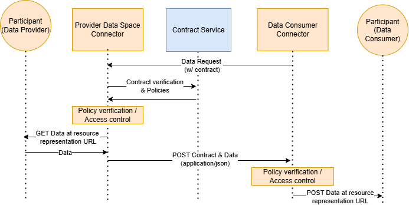
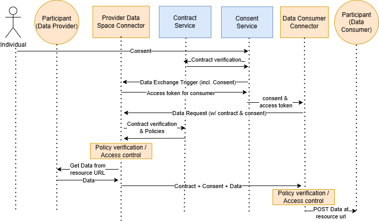
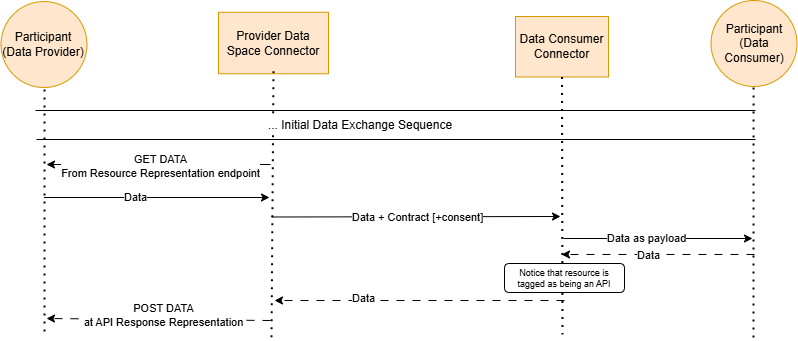
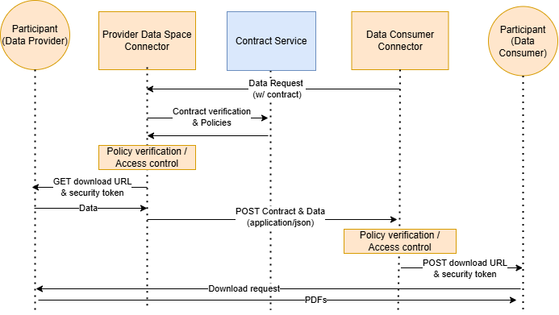

# Data Exchange

The main purpose of the data space connector is to enable data exchange between participants of the data space. The connector can handle 2 types of data exchange flows:

-   Non-personal B2B data exchange, where the data exchange happens between two participants and does not involve personal data, individuals or user consent.
-   Personal data exchange, where the data exchange is triggered by an individual granting his consent and the data is exchanged between two participants.

Data exchanges cannot be enforced without signed contracts between participants. Before attempting any data exchange, you should have a valid contract to use, either a Dataspace Use Case Contract or a Bilateral contract.

## How to Retrieve Your Contracts

To retrieve your contracts, you can make a request to the contract API specified in your configuration file under `contractUri`.

> If you are using an implementation of a Prometheus-X catalog. The corresponding platform should enable you to grab the necessary contract information from their UI. Removing the need to use the API for this.

To perform these requests, you need to use the URI pointing to your participant in the catalog, encode it in base64, and use it in the following routes:

### Example
The URL
```bash
https://api.catalog.com/v1/catalog/participants/66d18a1dee71f9f096baec08
```

points to a participant in the catalog. This information should be encoded in base64 and result in something like:

```bash
aHR0cDovL2hvc3QuZG9ja2VyLmludGVybmFsOjQwNDAvdjEvY2F0YWxvZy9wYXJ0aWNpcGFudHMvNjZkMThhMWRlZTcxZjlmMDk2YmFlYzA4
```

> There are many ways to encode in base64 and it is up to you to decide how to do it. Here's a simple example in javascript:
  ```js
  Buffer.from('URL').toString('base64');
  ```

### Contract Retrieval URLs:

Using the base64, you can get all bilateral agreements with
```bash
curl -X GET "http://your-contract-uri/bilaterals/for/aHR0cDovL2hvc3QuZG9ja2VyLmludGVybmFsOjQwNDAvdjEvY2F0YWxvZy9wYXJ0aWNpcGFudHMvNjZkMThhMWRlZTcxZjlmMDk2YmFlYzA4"
```

or use case agreements with
```bash
curl -X GET "http://your-contract-uri/contracts/for/aHR0cDovL2hvc3QuZG9ja2VyLmludGVybmFsOjQwNDAvdjEvY2F0YWxvZy9wYXJ0aWNpcGFudHMvNjZkMThhMWRlZTcxZjlmMDk2YmFlYzA4"
```

#### Optional query parameters
These endpoints allow query parameters to scope the contracts you wish to retrieve
| Parameter  | Value            | Description                                      |
|------------|------------------|--------------------------------------------------|
| `hasSigned` | `true` or `false` | Whether to retrieve only signed contracts or non-signed contracts |

It is also possible to get individual contracts using the following endpoints:
* `http://your-contract-uri/contracts/:your-contract-id`
* `http://your-contract-uri/bilaterals/:your-contract-id`

#### Expected Response Format

When you successfully retrieve a contract, the response will typically include the following fields:

<details>
  <summary>Click to expand</summary>

```jsonc
{
  "contracts": [
    {
      "_id": "66e84e6fa000b970362d952e",
      "dataProvider": "https://api.catalog.com/v1/catalog/participants/66d18724ee71f9f096bae810",
      "dataConsumer": "https://api.catalog.com/v1/catalog/participants/66d18a1dee71f9f096baec08",
      "serviceOffering": "https://api.catalog.com/v1/catalog/serviceofferings/66d187f4ee71f9f096bae8ca",
      "purpose": [
        {
          "purpose": "https://api.catalog.com/v1/catalog/serviceofferings/66d18b79ee71f9f096baecb0",
          "piiCategory": [],
          "_id": "66e84e6fa000b970362d952f"
        }
      ],
      "negotiators": [
        {
          "did": "https://api.catalog.com/v1/catalog/participants/66d18a1dee71f9f096baec08",
          "_id": "66e84e6fa000b970362d9530"
        },
        {
          "did": "https://api.catalog.com/v1/catalog/participants/66d18724ee71f9f096bae810",
          "_id": "66e84e6fa000b970362d9531"
        }
      ],
      "status": "signed",
      "policy": [
        {
          "description": "CAN use data without any restrictions",
          "permission": [
            {
              "action": "use",
              "target": "https://api.catalog.com/v1/catalog/serviceofferings/66d187f4ee71f9f096bae8ca",
              "constraint": [],
              "duty": []
            }
          ],
          "prohibition": []
        },
        {
          "description": "CAN use data without any restrictions",
          "permission": [
            {
              "action": "use",
              "target": "https://api.catalog.com/v1/catalog/serviceofferings/66d18b79ee71f9f096baecb0",
              "constraint": [],
              "duty": []
            }
          ],
          "prohibition": []
        }
      ],
      "signatures": [
        {
          "did": "https://api.catalog.com/v1/catalog/participants/66d18a1dee71f9f096baec08",
          "party": "https://api.catalog.com/v1/catalog/participants/66d18a1dee71f9f096baec08",
          "value": "HasSigned",
          "date": "2024-09-16T15:27:43.428Z"
        },
        {
          "did": "https://api.catalog.com/v1/catalog/participants/66d18724ee71f9f096bae810",
          "party": "https://api.catalog.com/v1/catalog/participants/66d18724ee71f9f096bae810",
          "value": "HasSigned",
          "date": "2024-09-16T15:27:43.449Z"
        }
      ],
      "revokedSignatures": [],
      "createdAt": "2024-09-16T15:27:43.305Z",
      "updatedAt": "2024-09-16T15:27:43.450Z",
      "__v": 3,
      "dataProcessings": "[{\"participant\": \"https://api.catalog.com/v1/catalog/participants/66d18a1dee71f9f096baec07\", \"serviceOffering\": \"https://api.catalog.com/v1/catalog/serviceofferings/66d18bf6ee71f9f096baed57\"}]"
    }
  ]
}
```

</details>

## Non-personal data exchange



The actors involved in the non personal B2B data exchange are the following:
|Actor|Description|
|-|-|
|Data Provider|A participant of the data space providing data. In this flow, we consider the data provider as both the entity responsible for the participant organisation and the participant application, which can be an API, a data source, or any kind of application.|
|Data Space Connector|Both participants have a data space connector in order to communicate with the infrastructure services and the other party's connector|
|Contract Service|An infrastructure service of the data space managing contracts and policies on data exchanges. It is used in this flow to verify the status and content of the contract to allow or block data exchange requests.|

### Process breakdown

> This process does not go over the negotiation and contractualisation process and assumes a data sharing agreement contract has already been signed between the two parties or that they are both part of an ecosystem in a data space use case agreement.

#### Requesting the data exchange trigger
One of the parties of the contract request a data exchange to happen based on a signed contract. This can be done either by the Data Provider or the Data Consumer through the following endpoint of the connector.

```bash
curl -X POST "https://YOUR_CONNECTOR_URL.com/consumer/exchange"
```

This endpoint requires a payload with differing mandatory information depending on the type of contract you are enforcing.

<details>
  <summary>Payload: Ecosystem / Dataspace Use Case Contracts [Most used]</summary>

  ```jsonc
  {
    // URI of the contract where the exchange is based
    // REQUIRED
    "contract": "https://contract.com/contracts/id",
    // Consumer service offering URI
    // REQUIRED
    "purposeId": "https://catalog.api.com/v1/catalog/serviceofferings/id",
    // Provider service offering URI
    // REQUIRED
    "resourceId": "https://catalog.api.com/v1/catalog/serviceofferings/id",

    // Provider params applied at all the provider data resource
    // OPTIONAL
    "providerParams": {
      "query": [
        {
          "page": 2
        },
        {
          "limit": 20
        }
      ]
    },
    // Selected resources with needed params
    // OPTIONAL and can be a array of string ["https://api.catalog.com/v1/catalog/dataresources/66d1889cee71f9f096bae98b"]
    "resources": [
        {
            "resource": "https://api.catalog.com/v1/catalog/dataresources/66d1889cee71f9f096bae98b",
            "params": {
                "query": [
                    {
                        "page": 2
                    },
                    {
                        "limit": 20
                    }
                ]
            }
        }
    ]
  }
  ```
</details>

<details>
  <summary>Payload: Bilateral Contract</summary>

  ```jsonc
  {
    // URI of the contract where the exchange is based
    // REQUIRED
    "contract": "https://contract.com/contracts/id",

    // Provider parameters applied on all the provider data resources
    // OPTIONAL
    "providerParams": {
      "query": [
        {
          "page": 2
        },
        {
          "limit": 20
        }
      ]
    },
    // Selected resources with needed parameters
    // OPTIONAL and can be a string[] - ["https://api.catalog.com/v1/catalog/dataresources/66d1889cee71f9f096bae98b"]
    "resources": [
        {
            "resource": "https://api.catalog.com/v1/catalog/dataresources/66d1889cee71f9f096bae98b",
            "params": {
                "query": [
                    {
                        "page": 2
                    },
                    {
                        "limit": 20
                    }
                ]
            }
        }
    ]
  }
  ```
</details>

<br>

> Based on the payload you provide, it will automatically identify if you are the consumer or the provider in the exchange, so the action is the same whether you are one or the other.

If everyting went right, the PDC will reply with a `200` status code response and proceed with the automated part of the process as explained below.

#### Automated Connector Process

1. The data provider connector receives the incoming data request and communicates with the contract service to verify the status of the contract and get the policies associated to the resources that have been contractualised in this context.
2. The contract service verifies the authenticity and the status of the contract and returns the ODRL policies that should be verified by the connector for access control.
3. The connector interprets the ODRL policies using the PEP (Policy Enforcement Point) located within the connector. If the policies are validated, the process continues, if not then the process ends and an error is returned to the data consumer's connector.
4. Data is pulled from the participant application using the resource representation located in the provider's offering(s) from the contract. The connector uses the [credentials](./CREDENTIALS.md) that have been set on the [resource's representation](./RESOURCE_REPRESENTATION.md) and, if set, [the parameters set for that exchange](./QUERY_PARAMS.md) to communicate with the participant application.

The PDC makes a HTTP GET request to the participant's resource including the following headers to allow participants to contextualize data exchanges and run specific custom processes when receiving expected information.

```bash
curl -X GET "https://provider-connector-url.com" \
  -H "x-ptx-incomingDataspaceConnectorURI: https://consumer-connector-url.com" \
  -H "x-ptx-dataExchangeId: <string>" \
  -H "x-ptx-contractId: <string>" \
  -H "x-ptx-contractURL: <string>" \
  -H "{credential_key}: {credential_value}"
```

> The connector expects a application/json or text/html response from that request.

> Note: the credential key value pair in the headers is set dynamically *if* credentials are defined on the resource for which the connector makes the request. Check information on [credentials](./CREDENTIALS.md) for more details.

5. The provider connector POSTs the data to the Data Consumer connector along with the contract information.
6. The consumer connector verifies policies on the contract to allow or block the provider to send the data and use the service provided by the data consumer acting as a service provider.
7. Data is pushed using a `HTTP POST` request to the consumer participant application using the [credentials](./CREDENTIALS.md) that were set on the [service resource representation](./RESOURCE_REPRESENTATION.md).

The consumer PDC makes a HTTP POST request to the consumer participant's resource including the following headers and the payload containing the raw data as returned by the Data Provider's resource.

```bash
curl -X POST "https://consumer-connector-url.com" \
  -H "x-ptx-incomingDataspaceConnectorURI: https://provider-connector-url.com" \
  -H "x-ptx-dataExchangeId: <string>" \
  -H "x-ptx-contractId: <string>" \
  -H "x-ptx-contractURL: <string>" \
  -H "{credential_key}: {credential_value}" \
  -H "Content-Type: application/json" \
  -d '{
      "field1": "value1",
      "field2": "value2",
      "field3": "value3"
    }'
```

## Consent-Driven data exchange



In addition to the actors from the previous data exchange flow, the consent-driven data exchange is triggered by an individual giving his consent for data sharing and thus, this adds a couple of actors to the flow.
|Actor|Description|
|-|-|
|Individual|The individual (user) who's data is being shared|
|Consent Service|The Personal Data Intermediary's consent service of the individual that manages consent and passes it around in the data exchange flow.|

### Process breakdown

1. The individual, through his PDI will grant consent for a specific data sharing.
2. The consent service will communicate with the contract service to verify the status of the data sharing contract that exists between the two participants for the wanted data exchange.
3. The consent service notifies the Provider's data space connector that an exchange needs to happen by providing the consent
4. The connector generates an access token to be used by the consumer and sends it back to the consent service, which will associate the token to the consent before sending it to the consumer's connector.
5. The consent service sends the consent to the Data space connector of the data consumer along with information as to what endpoint of the provider's data space connector to call to get data
6. The consumer connector makes the data request to the provider by providing the consent

The rest of the flow is in line with the process during a non-personal B2B data exchange.

### Precisions in headers regarding consent

In the context of a consent-based data exchange, when the PDC communicate with the participant resources, it will add 4 additionnal headers allowing the participants to contextualize the data exchange.

```bash
-H "consentId: <string>" \
-H "consent-id: <string>" \
-H "x-ptx-consent-id: <string>" \
-H "x-interlocutor-connector: <string>"
```

## API Consumption protocol



### Configuring Resources for API Consumption

The API Consumption protocol is a process in which PDCs are used in a way to allow Data Providers to **consume** a service from a Service Provider just like it would consume an API to receive data. To enable this, resources from both parties need to have metadata allowing the data or service to be used by this protocol.

### Configuring a Data Resource for API Consumption

From the **Data Provider**'s side, the data resource informed in the catalogue should be marked as **aimed to be an API payload**. This can be managed on your used catalogue.

Similar to a regular [data representation](./RESOURCE_REPRESENTATION.md) for the resource, it is essential to inform what type of source the data is retrieved from, what endpoint the PDC should call to get the data and if protected, the [credential identifier](./CREDENTIALS.md) associated to this resource.

By configuring the data resource that way, the Data Provider enables his PDC to automatically understand that this data is to be used for an API Consumption protocol and make the necessary adjustments in the data exchange flow to retrieve the data coming back from the Service Provider's API Service.

### Sequence breakdown

The base protocol for API Consumption does not change. Changes start to be observed when the data is shared.

Picking up from the moment where the Provider's connector sends data to the Consumer connector, if the Resource of the Consumer is marked as "being an API" AND returns data, the Consumer connector will process the response and send it over to the Provider Connector.

Once the Provider connector receives the data, it will look into the Provider's resource to look for a API Response Representation that should exist alongside the base resource representation to know where to send the API Response results and make a POST request to the defined endpoint of that representation.

#### Note: Configuration for PII

If the data resource is marked as including PII data, the URL defined for the endpoint to fetch the data should contain a **{userId}** that will be automatically be replaced by the PDC during the data exchange protocol by the identifier of the individual concerned by the data transaction. This is assuming that the data provider correctly configured his [user registration](https://github.com/Prometheus-X-association/dataspace-connector/blob/main/docs/USER_MANAGEMENT.md) through the PDC.

This is exactly the same process as defining a non-payload data resource.

### Configuring a Service Resource for API Consumption

From the **Service Provider**'s side, marking a service as an API is as simple as checking a box in the Service Resource's creation or edit page (as shown in the image below).

Marking a service resource as being an API allows the PDC to automatically adjust the data exchange protocol and send the API response back to the Data Provider.

## A mention to Control Plane vs Data Plane

In the current implementation of the connector. The control plane & data plane are tied, meaning that only the supported protocols for communication between the Connectors and the resource representations are available.

Currently the connector supports the following content types for data exchange
* application/json
* text/html

And usually work best with HTTP-based / RESTful APIs.

Although there is a plan to work on a clear possible separation of the control plane & data plane in the future, if you have a use case that involves exchanging data in another way (ex: downloading a PDF file), you can still use the Data Exchange Protocol to share the information related to the data transfer which can be operated by the consumer outside the protocol afterwards.

### Example

If we take the example mentionned above, we can suppose that:
* The Data Provider registers a Data Resource offer on the catalogue specifying that it will provide the necessary information for downloading a PDF file
* The Data Consumer has a Software Resource offer (Service) for consuming that information
* Both have a signed contract based on the offerings

The following image shows how this could happen


> This is an example and might not cover all use cases, but is here to show that you may still leverage the capabilities of dataspace contracts & the Prometheus-X control plane to make more complex data exchanges regardless of the desired protocols.

> For curious readers that are wondering how it will work with the [data processing chain protocol](https://github.com/prometheus-x-association/data-processing-chain-protocol). This protocol is one of the reasons why the control plane & data plane are tied, because chaining data processings by allowing external data transfers does not allow the chains to be synced up with the actual data being transferred. In first versions of the chain protocol, it will not be possible to have external data exchanges if there is a desire to plug in additionnal services in a chain.

---
\>\> [Resource Representation](./RESOURCE_REPRESENTATION.md)