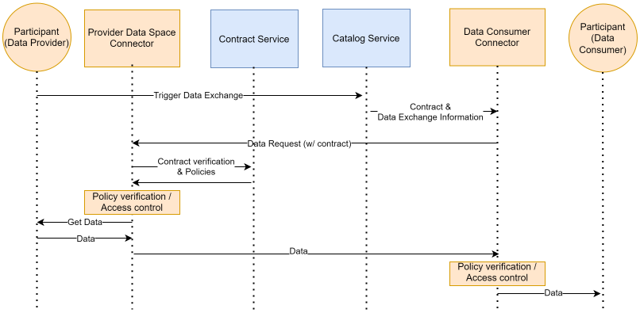
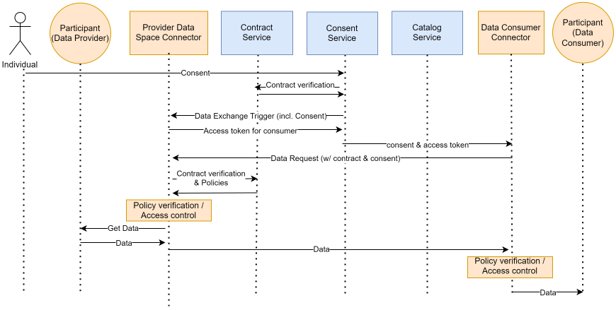
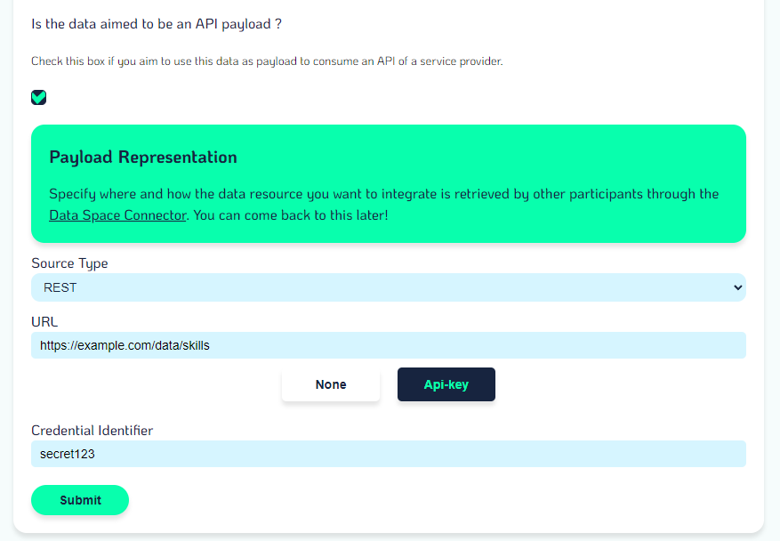
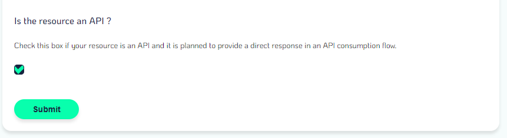

# Data Exchange

The main purpose of the data space connector is to enable data exchange between participants of the data space. The connector can handle 2 types of data exchange flows:

-   Non-personal B2B data exchange, where the data exchange happens between two participants and does not involve personal data, individuals or user consent.
-   Personal data exchange, where the data exchange is triggered by an individual granting his consent and the data is exchanged between two participants.

## Non-personal B2B data exchange


There actors involved in the non personal B2B data exchange are the following:
|Actor|Description|
|-|-|
|Data Provider|A participant of the data space providing data. In this flow, we consider the data provider as both the entity responsible for the participant organisation and the participant application, which can be an API, a data source, or any kind of application.|
|Data Space Connector|Both participants have a data space connector in order to communicate with the infrastructure services and the other party's connector|
|Contract Service|An infrastructure service of the data space managing contracts and policies on data exchanges. It is used in this flow to verify the status and content of the contract to allow or block data exchange requests.|
|Catalog Service|An Infrastructure service of the data space enabling the management of resources, offerings, data space use cases and interfaces to allow for negotiation and contractualisation.

### Process breakdown

This process does not go over the negotiation and contractualisation process and assumes a data sharing agreement contract has already been signed between the two parties.

1. One of the parties of the contract request a data exchange to happen based on a signed contract to the catalogue. While this process shows the option to trigger the data exchange from the catalogue, it is one of several ways of triggering a data exchange. To keep things simple, let's consider this use case first.
2. The catalogue provides data exchange information and the contract to the data consumer connector. This information doubles down on the contract information to specify to the connector who the data provider is in this context, and where to proceed with the actual data request.
3. The consumer connector makes the data request to the provider connector with the received data exchange information and contract.
4. The data provider connector receives the incoming data request and communicates with the contract service to verify the status of the contract and get the policies associated to the resources that have been contractualised in this context.
5. The contract service verifies the authenticity and the status of the contract and returns the ODRL policies that should be verified by the connector for access control.
6. The connector interprets the ODRL policies using the PEP (Policy Enforcement Point) located within the connector. If the policies are validated, the process continues, if not then the process ends and an error is returned to the data consumer's connector.
7. Data is pulled from the participant application using the resource representation located in the provider's offering(s) located in the contract. The connector uses the [credentials](./CREDENTIALS.md) that have been set on the [resource's representation](./RESOURCE_REPRESENTATION.md) to communicate with the participant application.
8. The provider connector POSTs the data to the Data Consumer connector
9. The consumer connector verifies policies on the contract to allow or block the provider to send the data and use the service provided by the data consumer acting as a service provider.
10. Data is pushed to the consumer participant application using the [credentials](./CREDENTIALS.md) that were set on the [service resource representation](./RESOURCE_REPRESENTATION.md).

## Consent-Driven data exchange



In addition to the actors from the previous data exchange flow, the consent-driven data exchange is triggered by an individual giving his consent for data sharing and thus, this adds a couple of actors to the flow.
|Actor|Description|
|-|-|
|Individual|The individual (user) who's data is being shared|
|Consent Service|The Personal Data Intermediary's consent service of the individual that manages consent and passes it around in the data exchange flow.|

### Process breakdown

1. The individual, through his PDI will grant consent for a specific data sharing.
2. The consent service will communicate with the contract service to verify the status of the data sharing contract that exists between the two participants for the wanted data exchange.
3. The consent service notifies the Provider's data space connector that an exchange needs to happen by providing the consent
4. The connector generates an access token to be used by the consumer and sends it back to the consent service, which will associate the token to the consent before sending it to the consumer's connector.
5. The consent service sends the consent to the Data space connector of the data consumer along with information as to what endpoint of the provider's data space connector to call to get data
6. The consumer connector makes the data request to the provider by providing the consent

The rest of the flow is in line with the process during a non-personal B2B data exchange.

---
# DATA FIELD IN CONSENT
To provide users with the ability to choose which data can be exchanged between participants in a consent, there is an optional field **data** in the body of the route for granting consent.
## How to use it
When retrieving privacy notices using the route _/private/consent/{userId}/{providerSd}/{consumerSd}_, there exists a field **data** which is an array of objects.
```json
{
      "_id": "6617f935dcc9a52416ab0b76",
      // other fields
      "data": [
        {
          "resource": "http://catalog.uri/v1/catalog/dataresources/65e71e4174f9e9026bd5dc41",
          "serviceOffering": "http://catalog.uri/v1/catalog/serviceofferings/65e71e5474f9e9026bd5dc51",
          "_id": "6617f935dcc9a52416ab0b78"
        },
        {
          "resource": "http://catalog.uri/v1/catalog/dataresources/65e7383974f9e9026bd5ee6c",
          "serviceOffering": "http://catalog.uri/v1/catalog/serviceofferings/65e71e5474f9e9026bd5dc51",
          "_id": "6617f2badcc9a52416ab0b27"
        }
      ]
}
```

When populating via the route _/private/consent/{userId}/privacy-notices/{privacyNoticeId}_, the resource can be found within the populated object.
```json
{
  "timestamp": 1712828877864,
  "code": 200,
  "content": {
    "_id": "6617ac91dcc9a52416ab08b9",
    // other fields
    "purposes": [
      {
        "@context": "http://host.docker.internal:4040/v1/softwareresource",
        "@type": "SoftwareResource",
        "_id": "65e71e9674f9e9026bd5dd3d",
        // other fields
        "resource": "http://host.docker.internal:4040/v1/catalog/softwareresources/65e71e9674f9e9026bd5dd3d"
      }
    ],
    "data": [
      {
        "@context": "http://catalog.uri/v1/dataresource",
        "@type": "DataResource",
        "_id": "65e7383974f9e9026bd5ee6c",
        //other fields
        "resource": "http://catalog.uri/v1/catalog/dataresources/65e7383974f9e9026bd5ee6c"
      },
      {
        "@context": "http://catalog.uri:4040/v1/dataresource",
        "@type": "DataResource",
        "_id": "65e71e4174f9e9026bd5dc41",
        //other fields
        "resource": "http://catalog.uri/v1/catalog/dataresources/65e71e4174f9e9026bd5dc41"
      }
    ]
  }
}
```

When a user wishes to give consent using the route _/private/consent/{userId}/{providerSd}/{consumerSd}_, they can select the desired data by simply sending the resource that corresponds to the URI of the data resource within the data body field.
```json
{
  "privacyNoticeId": "6617f935dcc9a52416ab0b76",
  "userId": "65646d4320ec42ff2e719706",
  "data": [
    "http://catalog.uri/v1/catalog/dataresources/65e7383974f9e9026bd5ee6c"
  ]
}
```

>The data field is optional; if it is not provided or empty, **all** the data will be used for the data exchange.
---
# How to trigger a B2B data exchange through the API connector
You can trigger a data exchange when you are consumer through your connector with the API route
```json
{your_connetor_url}/consumer/exchange
```
The request body parameters are the following
```json
{
  // Provider connector endpoint
  // required
  "providerEndpoint": "https://provider.connector.com/",
  // URI of the contract where the exchange is based
  // required
  "contract": "https://contract.com/contracts/id",
  // Consumer service offering URI
  // optional
  "purposeId": "https://catalog.api.com/v1/catalog/serviceofferings/id",
  // Provider service offering URI
  // optional
  "resourceId": "https://catalog.api.com/v1/catalog/serviceofferings/id"
}
```

## Bilateral contract

In case of a bilateral contract the needed payload need only the contract
```json
{
  "contract": "https://contract.com/contracts/id"
}
```

## Data use case contract
In case of a data use case contract all the params are required

```json
{
  "providerEndpoint": "https://provider.connector.com/",
  "contract": "https://contract.com/contracts/id",
  "purposeId": "https://catalog.api.com/v1/catalog/serviceofferings/id",
  "resourceId": "https://catalog.api.com/v1/catalog/serviceofferings/id"
}
```
---
# Configuring Resources for API Consumption

The API Consumption protocol is a process in which PDCs (Prometheus-X Dataspace Connector) are used in a way to allow Data Provider to **consume** a service from a Service Provider just like it would consume an API to receive data. To enable this, resources from both parties need to have metadata allowing the data or service to be used by this protocol.

## Configuring a Data Resource for API Consumption

From the **Data Provider**'s side, the data resource informed in the catalogue should be marked as **aimed to be an API payload**. This can be done through your data resource creation or edit page as shown in the image below.



As for a regular data representation for the resource, it is essential to inform what type of source the data is retrieved from, what endpoint the PDC should call to get the data and if protected, the [credential identifier](https://github.com/Prometheus-X-association/dataspace-connector/blob/main/docs/CREDENTIALS.md) associated to this resource.

By configuring the data resource that way, the Data Provider enables his PDC to automatically understand that this data is to be used for an API Consumption protocol and make the necessary adjustments in the data exchange flow to retrieve the data coming back from the Service Provider's API Service.

### Note: Configuration for PII

If the data resource is marked as including PII data, the URL defined for the endpoint to fetch the data should contain a **{userId}** that will be automatically be replaced by the PDC during the data exchange protocol by the identifier of the individual concerned by the data transaction. This is assuming that the data provider correctly configured his [user registration](https://github.com/Prometheus-X-association/dataspace-connector/blob/main/docs/USER_MANAGEMENT.md) through the PDC.

This is exactly the same process as defining a non-payload data resource.

## Configuring a Service Resource for API Consumption

From the **Service Provider**'s side, marking a service as an API is as simple as checking a box in the Service Resource's creation or edit page (as shown in the image below).



Marking a service resource as being an API allows the PDC to automatically adjust the data exchange protocol and send the API response back to the Data Provider.

---
\>\> [Resource Representation](./RESOURCE_REPRESENTATION.md)