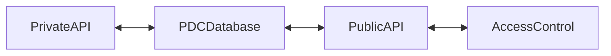

# Getting started with the data space connector

To get started with the data space connector, you have several options. The project comes with a docker file that allows you to easily install it at any location you see fit. The second option is to run the project without using docker and while possible, it requires additionnal overhead configuration.

## Composition & architecture

One of the aims for the data space connector was to keep it light and simple and only include the most mandatory and necessary features related to interactions with the data space.

Four services compose the architecture of the connector



| service        | description                                                                                                                                                                                                                                                                                                                           |
| -------------- | ------------------------------------------------------------------------------------------------------------------------------------------------------------------------------------------------------------------------------------------------------------------------------------------------------------------------------------- |
| Admin API      | Allows for administration and configuration of the connector through API                                                                                                                                                                                                                                                              |
| Public API     | Exposes the public endpoints for communication with the infrastructure services of the data space and to enable data exchange flows                                                                                                                                                                                                   |
| Mongo Database | The "internal" database of the connector holding necessary information for the configuration of the connector as well as tracking data exchange processes. Currently, the connector only supports a mongo database for this purpose, however, the addition of more database support is planned to enable easier custom configurations |
| ODRL Manager   | The Policy enforcement point and contract verifications of the connector relying on Prometheus-X's [ODRL Manager library](https://github.com/Prometheus-X-association/odrl-manager) for ODRL interpretation                                                                                                                           |

## Configuration of the connector

The connector can be configured one of two ways, either through manual editing of a JSON configuration file, or by making individual configuration calls to the Admin API.

### Configuring Environment and JSON Files for the Data Space Connector

To correctly set up the data space connector, you need to create configuration files with appropriate suffixes. These suffixes are directly tied to the commands defined in the `scripts` section of the `package.json` file.

#### The `.env` file

The `.env` file is used to define environment variables in a key-value format, controlling various runtime settings like ports, database connections, and secrets.

##### File Naming Convention

Create `.env.ENV` files where ENV matches the script suffix from the package.json file. For example:

- For `npm run dev` &rarr; `.env.development`
- For `npm run start` &rarr; `.env.production`

##### Example Content of `.env.development`

```
NODE_ENV=development
PORT=3401
SESSION_SECRET=abc
SESSION_COOKIE_EXPIRATION=24000
MONGO_URI=mongodb://localhost:27017/dataspace-connector
MONGO_DATABASE=dataspace-connector
CURATOR=https://visionspol.eu
MAINTAINER=https://visionspol.eu
# Logs
WINSTON_LOGS_MAX_FILES=14d
WINSTON_LOGS_MAX_SIZE=20m
```

#### The config.ENV.json file

The config.ENV.json file is used to configure the data space connector's settings. It is a JSON file that contains key-value pairs, where each key is a configuration option and each value is the value assigned to that option.

To enable editing of the config.json file, start by copying the [config.sample.json](../src/config.sample.json) to a config.ENV.json file. The configuration file requires a suffix based on the command used to launch the connector. The suffix `ENV` must match the command used in package.json.

##### Steps to Create the File

- copy the sampe configuration file 

```bash
cp config.sample.json config.development.json
```

- Modify the `config.development.json` as needed

##### File naming convention

- `npm run dev` → `config.development.json`
- `npm run start` → `config.production.json`

The contents of the config.json file are simple

```jsonc
{
    "endpoint": "", // Default endpoint of the connector
    "serviceKey": "", // Client ID API credential for the catalogue
    "secretKey": "", // Client Secret API credential for the catalogue
    "catalogUri": "", // URL of the catalogue) service to use
    "contractUri": "", // URL of the contract service to use
    "consentUri": "", // URL of the cocnsent service to use
    "credentials": [
        // Optional - to manually add credentials into the connector
        {
            "_id": "", // Or use the command npm run uid --number=1 to generate id
            "value": "", // Password or value
            "type": "", // "apiHeader" | "basic"
            "key": "" // Username or key
        }
    ],
    "registrationUri": "", // Participant API URL where users can be registered (see docs)
    "expressLimitSize": "" // Express limit body size, only kb, mb and gb accepted, example: 20mb, 200kb, 2gb
}
```

| key                | description                                                                                                                                                                                                                                                                                                       |
| ------------------ | ----------------------------------------------------------------------------------------------------------------------------------------------------------------------------------------------------------------------------------------------------------------------------------------------------------------- |
| `endpoint`         | This is where the connector lives, as the connector is an independant application, it has its own domain, the default endpoint is the base url for this domain. When running a GET request on this endpoint the connector will serve its public Self-Description                                                  |
| `serviceKey`       | When onboarded onto a [Catalogue](https://github.com/Prometheus-X-association/catalog-api), the catalogue will generate API credentials for the participant. These can then be used to generate a bearer JWT token to authenticate requests to the catalogue's API. The serviceKey is the equivalent for clientID |
| `secretKey`        | The equivalent for clientSecret of the Catalogue API credentials                                                                                                                                                                                                                                                  |
| `catalogUri`       | The base URL of the [Catalogue](https://github.com/Prometheus-X-association/catalog-api) service used as infrastructure service.                                                                                                                                                                                  |
| `contractUri`      | The base URL of the [Contract](https://github.com/Prometheus-X-association/contract-manager) service used as infrastructure service.                                                                                                                                                                              |
| `consentUri`       | The base URL of the [Consent](https://github.com/Prometheus-X-association/consent-manager) service used as infrastructure service.                                                                                                                                                                              |
| `credentials`      | [optional] Credentials used by the connector to communicate with your application. More details about credentials can be found [here](./CREDENTIALS.md).                                                                                                                                                          |
| `registrationUri`  | [optional] The endpoint that will be used by the connector to attempt to register individuals automatically when needed. More information about what this endpoint is for is exlained in the consent flows of the [User Management section](./USER_MANAGEMENT.md#consent-flows-for-user-management)               |
| `expressLimitSize` | [optional] Optional configuration to increase the body size of request that express can accept, by default it's set to 2mb. you can increase or decrease this value by setting this params. The value accepted are "kb", "mb" and "gb". Example: 200kb, 20mb, 2gb.                                                |

The catalogUri, consentUri and contractUri should end with a "/" to work properly (ex: http://catalog.api.com/v1/ depending on the catalog you will use).

#### Option 1. Manual edition of the configuration

As stated above, one of the ways to edit the configuration is to get your hands dirty and manually edit the config.json file to update these values. It is the recommended approach as the simplest to use and since there only a very few amount of values to edit, it remains a very quick configuration process.

#### Option 2. Editing the configuration through API

The Admin API of the data space connector enables for updating configuration values through authenticated PUT requests. This can be useful for any integration & automation of the connector's configuration.

```bash
PUT /private/configuration
```

with a payload specifying one or more of the following values

```json
{
    "endpoint": "<string>",
    "serviceKey": "<string>",
    "secretKey": "<string>",
    "catalogUri": "<string>",
    "contractUri": "<string>",
    "consentUri": "<string>"
}
```

### Why do I need to specify my API credentials to the connector ?

The Data Space Connector runs API calls and processes on behalf of the participant when interacting with infrastructure services to manage resources and participate in data exchanges. The infrastructure services require authentication to be used, and in that regard, the authentication used should be based on the participant's API credentials.

### Why do I need to specify the Catalog / Contract / Consent service used ?

Prometheus-X's idea is to have "n" amount of Prometheus-X Catalogue services, contract services or consent services. Any entity wanting to have the responsibility of managing a catalogue service can take the Prometheus-X catalogue code and run an instance of it allowing for a wider array of participation in data spaces.

The `catalogUri` that should be specified is the one where the participant has onboarded itself in order for the data space connector to communicate with the catalogue that knows the participant.

### How to register to the Consent service

Once you know which PTX Consent service you will use, you need to register to this service using the route `POST http://consent-uri/participants`.

See more on the [documentation](https://prometheus-x-association.github.io/consent-manager/#/participants/post_participants).

#### A note about federation

Although federation of catalogues is not currently available, one of the aims of the connector is to use the Gaia-X Credential Events Service (CES) that is built to allow for catalogue federation

---

\>\> [Data Exchange](./DATA_EXCHANGE.md)
