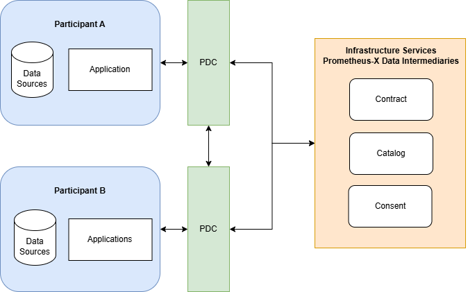

# Overview

The Data Space Connector is an open source project aimed to facilitate the onboarding and participantion of organisations in the data space. It is built with simplicity in mind and offers the necessary functionalities for organisations to communicate with the core components of the data space such as [Catalogue](https://github.com/Prometheus-X-association/catalog-api) for resources, offerings and data space use cases management, [Contract](https://github.com/Prometheus-X-association/contract-manager) for negotiation and contract verification and [Consent](https://github.com/Prometheus-X-association/consent-manager) for the management of consent driven data exchanges.

## Who is the data space connector for ?

The Data Space Connector is aimed towards data providers and service providers. As the connector facilitates the integration to the data exchange flows, both data providers and service providers will find value in the connector to be able to take part in these data exchanges.

The connector offers features that enable data providers to easily configure how the connector will pull the data from their data sources depending on the contractualised resource(s) being exchanged, and features that enable service providers to configure how the connector will push received data to their data sources.

## Why should I use the data space connector ?

The Data Space Connector is not mandatory to participate in data spaces. As the code is open source, you are free to make your own implementation of the necessary integrations to be able to take part in data exchanges in the data space. However, the connector streamlines many of the process and takes away a lot of the complexity of integration.

The connector offers:
- Automatic registration of connector endpoints on the catalogue
- Pre-configured endpoints to take part in the data exchange flows
- Integrated communication with contract services to verify data exchange contracts
- Integrated policy enforcement on data exchange endpoints
- A streamlined process for handling user identities in consent services
- Configuration processes to ease the data push/pull from/to your data sources

These are some of the points to keep in mind if you decide to go with making a custom implementation.

---
\>\> [Getting started](./GETTING_STARTED.md)