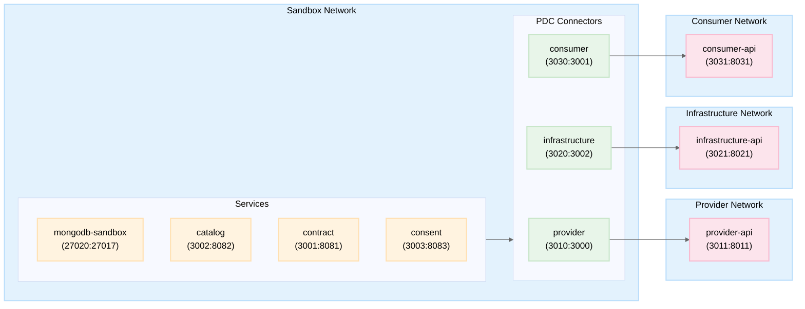

# SANDBOX

The sandbox is a docker compose file whichs allows to test the interaction with multiple connectors locally. 

## Architecture

The sandbox environment consists of several interconnected services:

- 3 PDC connectors (Provider, Consumer, Infrastructure)
- 1 MongoDB database
- Mock services for external APIs
- Core PTX Data Intermediary Services (Contract, Catalog, Consent)



Each service runs in its own container and communicates through defined networks.

### Network Architecture

The sandbox uses four distinct networks:

- `sandbox`: Main network connecting shared services (MongoDB, Contract, Catalog, Consent)
- `provider`: Isolated network for Provider PDC and its API
- `consumer`: Isolated network for Consumer PDC and its API
- `infrastructure`: Isolated network for Infrastructure PDC and its API

This network separation ensures proper isolation and security between components.

## How to use

1. Make sure you have Docker and Docker Compose installed
2. Navigate to the sandbox/infrastructure directory
3. Run `docker-compose up` to start all services
4. Wait for all services to be healthy (you can check with `docker ps`)

### Database Setup

#### MongoDB

- Container name: `mongodb-sandbox`
- Port: 27020 (mapped to internal 27017)
- Initial data is seeded via the `mongo-seed` service
- Connected to sandbox network

### PDCs

The sandbox includes three Connector (PDC) instances:

#### Provider

- Container name: `provider`
- Port: 3010 (mapped to internal 3000)
- Connected to sandbox and provider networks
- Environment configuration: `/utils/provider/.env.provider`

#### Consumer

- Container name: `consumer`
- Port: 3030 (mapped to internal 3001)
- Connected to sandbox and consumer networks
- Environment configuration: `/utils/consumer/.env.consumer`

#### Infrastructure

- Container name: `infrastructure`
- Port: 3020 (mapped to internal 3002)
- Connected to sandbox and infrastructure networks
- Environment configuration: `/utils/infrastructure/.env.infrastructure`

### Mocks

The sandbox includes several mock services to simulate external BB:

#### Contract

- Container name: `contract`
- Port: 3001 (mapped to internal 8081)
- Simulates contract management service
- Connected to sandbox network

#### Consent

- Container name: `consent`
- Port: 3003 (mapped to internal 8083)
- Simulates consent management service
- Connected to sandbox network
- node express app to allow more complex mock

#### Catalog

- Container name: `catalog`
- Port: 3002 (mapped to internal 8082)
- Simulates catalog service
- Connected to sandbox network
- Required by PDC connectors

#### APIs

Mock API services are provided for each PDC:

- **Consumer API**
  - Container name: `consumer-api`
  - Port: 3031 (mapped to internal 8031)
  - Connected to consumer network only
  - Simulates external consumer systems

- **Provider API**
  - Container name: `provider-api`
  - Port: 3011 (mapped to internal 8011)
  - Connected to provider network only
  - Simulates external provider systems

- **Infrastructure API**
  - Container name: `infrastructure-api`
  - Port: 3021 (mapped to internal 8021)
  - Connected to infrastructure network only
  - Simulates external infrastructure systems

### Available tests

The sandbox environment allows testing of:

1. [Provider to Consumer exchange inside a project](./sandbox/provider-consumer-project.md)
2. [Data Processing Chain Protocol Exchange inside a project](./sandbox/dpcp-project.md)
3. [Data Processing Chain Protocol Exchange based on a consent](./sandbox/dpcp-consent.md)

To run tests, ensure all services are up and running, then execute the test suite from your development environment.

### Troubleshooting

Common issues and solutions:

1. **Service won't start**
   - Check logs with `docker logs <container_name>`
   - Verify all required environment variables are set
   - Ensure no port conflicts on your host machine

2. **Network connectivity issues**
   - Verify the service is connected to the correct networks
   - Check network isolation is working as expected
   - Use `docker network inspect <network_name>` to debug

3. **Database connection issues**
   - Ensure MongoDB is running and healthy
   - Verify the mongo-seed service has completed successfully
   - Check database connection strings in environment files

### Maintenance

To maintain the sandbox:

1. **Cleaning up**

   ```bash
   docker-compose down -v  # Remove containers and volumes
   docker-compose down --rmi all  # Remove containers and images
   ```

2. **Updating services**
   - Rebuild specific service: `docker-compose build <service_name>`
   - Rebuild all: `docker-compose build`

3. **Logs**
   - View logs: `docker-compose logs -f [service_name]`
   - Check container status: `docker-compose ps`

## Important Note

⚠️ **Current Limitations and Future Expansion**

The current sandbox environment is restricted to testing basic interactions within a single project context. Future updates will expand the testing capabilities to include:

- [ ] More complex DPCP exchanges scenarios
- [ ] Multiple provider/consumer scenarios
- [ ] Consent based exchange without dataProcessing
- [ ] Error cases and edge scenarios
- [ ] Performance testing (payload size)
- [ ] Security testing scenarios (credential)
- [ ] Query params scenarios

These limitations are temporary, and the sandbox environment will be continuously updated to support more comprehensive testing scenarios. Please check for updates regularly as new test cases are added.
