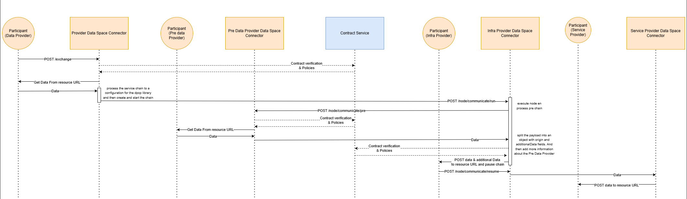
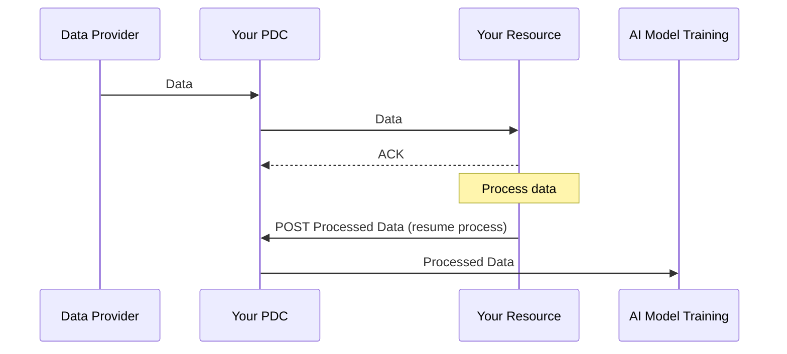
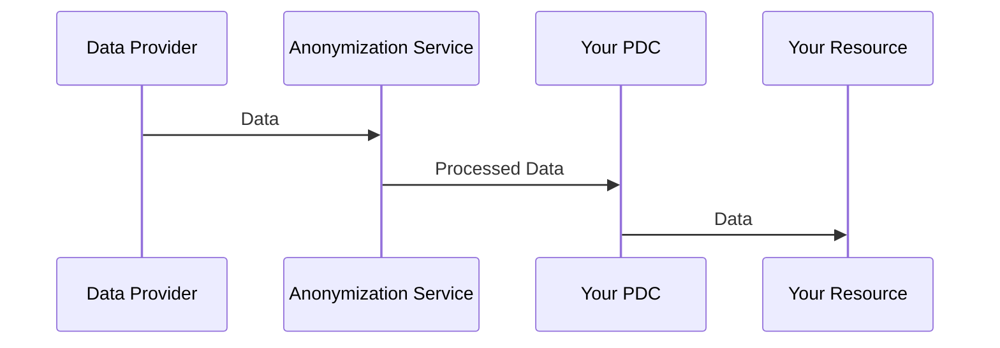
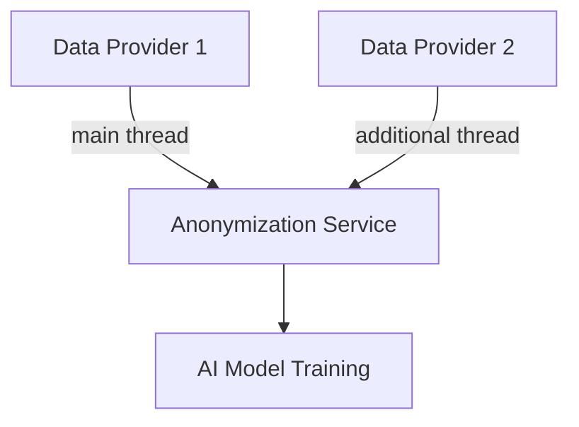

# Service Chain Protocol

Service chains are sequences of data transfers between participants, made possible through the use of multi-party ecosystem contracts and the integration of Prometheus-X's [Data Processing Chain Protocol library](https://github.com/prometheus-x-association/data-processing-chain-protocol) directly within the PDC.

It is aimed to handle *automatic* communications between participants. However, there are a few constraints to keep in mind.

- The protocol is different from the base protocol defined in [data exchange](./DATA_EXCHANGE.md), and involves a different way of interacting with it.
- The process is not fully automatic by default, since it involves participants to handle notifying their PDC whenever they have finished processing the data once its their turn.
- It is expected for participants to implement this additionnal layer of management for their service offerings for whenever a data exchange based on a service chain is activated.

> The service chain protocol is not a replacement for existing protocol. It's a different protocol, with a specific workflow that CAN be used if specified.

## Prerequisites

In order to activate a service chain, you *need* to have a signed ecosystem contract which includes you as a participant and which also includes a service chain configuration. Essentially, you need to ensure you fit the following conditions:

- You have joined or initiated an ecosystem
- You have negotiated a service offering to be used inside of this ecosystem (if you are not the orchestrator)
- You have signed the contract of this ecosystem
- The orchestrator has created a service chain based on the offerings available in the ecosystem
- You are either the *Orchestrator* / the *starting Data Provider* or the *Data Consumer*
- Your IT system behind the service offering is ready to interact with an incoming service chain-based request (see [preparing for interaction with the service chain](#preparing-for-interaction-with-the-service-chain)).

## Usage

To use a service chain during an exchange, you can pass the ID of the chain located in the ecosystem contract to the `POST /exchange` endpoint by adding the `serviceChainId` field which should match the ID of the chain that has been created for a contract.

```bash
curl -X POST https://YOUR_PDC_ENDPOINT/exchange \
-H "Content-Type: application/json" \
-d '{
  "contract": "https://PTX_CONTRACT_SERVICE/contracts/CONTRACT_ID",
  "serviceChainId": "SERVICE_CHAIN_ID"
}'
```

> Important:
>
> The service chain needs to exist in the contract for this to work properly.

### How to retrieve the `serviceChainId`

The serviceChainId refers to the `catalogId`, that you will find inside the field `serviceChains` or `recipientThirdParties`, depending on whether it is a contract or a consent.

> The reason for the name "catalogId" is because the service chain information is located in an ecosystem inside the associated catalogue, and represent the ID of the chain within this catalogue.

#### Retrieving from an Ecosystem Contract

To retrieve a contract, you can refer to the [Data Exchange section](./DATA_EXCHANGE.md#how-to-retrieve-your-contracts).

expected output :

```jsonc
{
  "_id": "670e8eb6b439a2379f290fc6",
  // others fields
  "serviceChains": [
    {
      "catalogId": "670e8eb6b439a2379f290fc1", // The serviceChainId in the catalog
      "services": [
        {
          "participant": "https://api.catalog.com/v1/catalog/participants/66d18724ee71f9f096bae810",
          "service": "https://api.catalog.com/v1/catalog/serviceofferings/672c89cb870a096712ca4d59",
          "_id": "674981ed70a7d9606bb2ed43"
        },
        {
          "participant": "https://api.catalog.com/v1/catalog/participants/66d18a1dee71f9f096baec07",
          "service": "https://api.catalog.com/v1/catalog/serviceofferings/672c8e77870a096712ca7676",
          "_id": "674981ed70a7d9606bb2ed44"
        },
        {
          "participant": "https://api.catalog.com/v1/catalog/participants/66d18a1dee71f9f096baec08",
          "service": "https://api.catalog.com/v1/catalog/serviceofferings/672c8ae4870a096712ca56d7",
          "_id": "674981ed70a7d9606bb2ed45"
        }
      ],
      "status": "active",
      "_id": "674981ed70a7d9606bb2ed42"
    },
    {
      "catalogId": "670e8eb6b439a2379f290fc2", // The serviceChainId in the catalog
      "services": [
        {
          "participant": "https://api.catalog.com/v1/catalog/participants/66d18724ee71f9f096bae810",
          "service": "https://api.catalog.com/v1/catalog/serviceofferings/672c89cb870a096712ca4d59",
          "_id": "674981ed70a7d9606bb2ed47"
        },
        {
          "participant": "https://api.catalog.com/v1/catalog/participants/66d18a1dee71f9f096baec07",
          "service": "https://api.catalog.com/v1/catalog/serviceofferings/672c8dbf870a096712ca74fd",
          "_id": "674981ed70a7d9606bb2ed48"
        },
        {
          "participant": "https://api.catalog.com/v1/catalog/participants/66d18a1dee71f9f096baec08",
          "service": "https://api.catalog.com/v1/catalog/serviceofferings/672c8ae4870a096712ca56d7",
          "_id": "674981ed70a7d9606bb2ed49"
        }
      ],
      "status": "active",
      "_id": "674981ed70a7d9606bb2ed46"
    }
  ]
}
```

#### Retrieving from a Consent

For information on the endpoints handling consent in your connector, refer to the [swagger](./swagger.json) documentation.

expected privacy notice output:

```jsonc
{
  "_id": "6734ceb9b36f3b579c92854f",
  // other fields
  "serviceChains": [
    {
      "status": "active",
      "catalogId": "670e8eb6b439a2379f290fc7", // The serviceChainId in the catalog
      "services": [
        {
          "_id": "6734ce54524aaf1488398f84",
          "participant": "https://api.catalog.com/v1/catalog/participants/66d18724ee71f9f096bae810",
          "service": "https://api.catalog.com/v1/catalog/serviceofferings/66d187f4ee71f9f096bae8ca"
        },
        {
          "_id": "6734ce54524aaf1488398f85",
          "participant": "https://api.catalog.com/v1/catalog/participants/66d18a1dee71f9f096baec07",
          "service": "https://api.catalog.com/v1/catalog/serviceofferings/66d18b79ee71f9f096baecb7",
          "params": {
            "custom": "custom"
          },
          "configuration": "671a73867bb2447c8085d96f"
        },
        {
          "_id": "6734ce54524aaf1488398f86",
          "participant": "https://api.catalog.com/v1/catalog/participants/66d18a1dee71f9f096baec08",
          "service": "https://api.catalog.com/v1/catalog/serviceofferings/66d18b79ee71f9f096baecb1",
          "params": {
            "custom": "custom"
          },
          "configuration": "6720a0249cb2e866c196c10f"
        }
      ]
    }
  ]
}
```

Expected consent output :

```jsonc
{
  "record": {
    "schemaVersion": "0.2.0",
    "recordId": "67365aa390089d27f1506887",
    "piiPrincipalId": "660fff4528678b2683bab15f"
  },
  "piiProcessing": {
    "privacyNotice": "6734ce6eb36f3b579c928548",
    // other fields
    "purposes": [
      {
        // other fields
        "recipientThirdParties": [
          {
            "catalogId": "670e8eb6b439a2379f290fc1", // the serviceChainId in the catalog
            "services": [
              {
                "participant": "https://api.catalog.com/v1/catalog/participants/66d18724ee71f9f096bae810",
                "service": "https://api.catalog.com/v1/catalog/serviceofferings/672c89cb870a096712ca4d59",
                "_id": "67365aa390089d27f1506888"
              },
              {
                "participant": "https://api.catalog.com/v1/catalog/participants/66d18a1dee71f9f096baec07",
                "service": "https://api.catalog.com/v1/catalog/serviceofferings/672c8e77870a096712ca7676",
                "_id": "67365aa390089d27f1506889"
              },
              {
                "participant": "https://api.catalog.com/v1/catalog/participants/66d18a1dee71f9f096baec08",
                "service": "https://api.catalog.com/v1/catalog/serviceofferings/672c8ae4870a096712ca56d7",
                "_id": "67365aa390089d27f150688a"
              }
            ]
          }
        ],
      }
    ]
  },
  // other fields
}
```

## Protocol



### Payloads

As the Service Chain protocol is a different protocol from the standard data exchange protocol, some adjustments are expected from the participants in the way they handle the incoming payloads coming from their PDC and what they need to provide to it when done with their processing of the data.

Examples of the different payloads shared and expected by the PDC are demonstrated below.

### Headers

The service chain provides a bunch of context information through the headers of the request to avoid over-complexifying the payloads passed around. The following headers are some you will find on each request your PDC will make to your resource when in the context of a service chain.

| Header                              | Description                                                                                           | Example Value                                                                                   |
|--------------------------------------|-------------------------------------------------------------------------------------------------------|-------------------------------------------------------------------------------------------------|
| `accept`                            | Accepted response content types                                                                       | `application/json, text/plain, */*`                                                             |
| `content-type`                      | Content type of the request body                                                                      | `application/json`                                                                              |
| `x-ptx-service-chain-id`            | ID generated by the Data Processing Chain library                                                     | `@supervisor:67f66a90cc0846cc99ab840a-1744205196870-1bcec18e`                                   |
| `x-ptx-service-chain-previous-target`| Previous resource in the service chain                                                                | `https://catalog.com/v1/catalog/serviceofferings/previous-resource-id`                          |
| `x-ptx-service-chain-next-target`    | Next resource in the service chain                                                                    | `https://catalog.com/v1/catalog/serviceofferings/next-resource-id`                              |
| `x-ptx-target-id`                   | Current resource being processed                                                                      | `https://catalog.com/v1/catalog/infrastructureservices/current-resource-id`                     |
| `x-ptx-incomingdataspaceconnectoruri`| First node's connector URI                                                                            | `https://provider.pdc/`                                                                         |
| `x-ptx-dataexchangeid`               | Data exchange ID relative to the active participant                                                   | `67f6758caed89eb179984140`                                                                      |
| `x-ptx-contractid`                   | ID of the current contract being used                                                                 | `67f3dc0a63abc4c89b80c161`                                                                      |
| `x-ptx-contracturl`                  | Full URL with the ID of the current contract being used                                               | `https://contract.com/contracts/67f3dc0a63abc4c89b80c161`      

### Payload received as a Participant in the middle of the chain

If your service offering is not placed at the very start or very end of the service chain, you have the responsability to notify to your PDC once your data processing is complete in order to resume the chain.


The information your PDC will receive is as follows:

```json
{
  // Arbitrary data that comes from n-1 (array / json object or string 
  // depending on what was sent by the previous participant)
  "data": [
    {
      "_id": "65646d4320ec42ff2e719706",
      "email": "participant+1@email.com",
      "verified_email": true,
      "schema_version": "1",
      "createdAt": "2024-02-22T14:52:04.389Z",
      "updatedAt": "2024-07-15T09:50:29.883Z",
      "__v": 0,
      "skills": "[\"office suite\", \"windows\"]"
    },
    {
      "_id": "656473537815cf3703d26302",
      "email": "participant+2@email.com",
      "verified_email": true,
      "schema_version": "1",
      "createdAt": "2024-02-22T14:52:04.389Z",
      "updatedAt": "2024-05-30T09:34:11.163Z",
      "__v": 0,
      "skills": "[\"office suite\", \"windows\"]"
    }
  ],
  "contract": "https://contract.visionstrust.com/contracts/67f3dc0a63abc4c89b80c161",
  "params": {
    "foo": "bar"
  }
}
```

### Payload received as the data consumer / final node




```json
{
  "data": [
    {
      "_id": "65646d4320ec42ff2e719706",
      "email": "participant+1@email.com",
      "verified_email": true,
      "schema_version": "1",
      "createdAt": "2024-02-22T14:52:04.389Z",
      "updatedAt": "2024-07-15T09:50:29.883Z",
      "__v": 0,
      "skills": "[\"office suite\", \"windows\"]"
    },
    {
      "_id": "656473537815cf3703d26302",
      "email": "participant+2@email.com",
      "verified_email": true,
      "schema_version": "1",
      "createdAt": "2024-02-22T14:52:04.389Z",
      "updatedAt": "2024-05-30T09:34:11.163Z",
      "__v": 0,
      "skills": "[\"office suite\", \"windows\"]"
    }
  ],
  "contract": "https://contract.com/contracts/67f3dc0a63abc4c89b80c161",
  "params": {
    "foo": "bar"
  },
  "previousNodeParams": {
    "paramsFromPreviousNode": "something"
  }
}
```

### Special case 1: There is additionnal data being requested by your PDC

One of the complexities that the Service Chain protocol has to face is when discussing workflows where additionnal data can be requested by a specific node before running the process it is aimed to do.

As this may be difficult to visualize, here is an example:



> In the example above, the Data Provider 1 is the official "starting node" set in the service chain, and Data Provider 2 is set to provide data before the Anonymization Service runs.

In a scenario like this one, since Prometheus-X does not currently have an Aggregation Service Building Block, the PDC does some form of simple aggregation by merging the payloads of the main thread and any n amount of additionnal threads.

Since we can have n amount of additionnal threads, each one is represented by an object with the following properties

| Property | Description |
| -------- | -------- |
| participant | a JSON `object` that provides information on who is providing this data |
| params | Any custom parameters provided by this data provider participant |
| data | The actual data shared, which can be either an `array`, an `object` or a `string`. The PDC does not alter the data structure sent by the participant.

```jsonc
{
  "data": {
    "additionalData": [ // Data from the additionnal thread
      {
        "participant": {
          "name": "Test-Infrastructure",
          "connectorUrl": "https://infra.pdc/",
          "id": "66d18a1dee71f9f096baec07"
        },
        "params": {
          "params1": "something"
        },
        "data": {
          "category": [
            "categoryA",
            "categoryB",
            "categoryC",
            "categoryD"
          ]
        }
      }
    ],
    "origin": [ // Data from the main thread
      {
        "_id": "65646d4320ec42ff2e719706",
        "email": "participant+1@email.com",
        "verified_email": true,
        "schema_version": "1",
        "createdAt": "2024-02-22T14:52:04.389Z",
        "updatedAt": "2024-07-15T09:50:29.883Z",
        "__v": 0,
        "skills": "[\"office suite\", \"windows\"]"
      },
      {
        "_id": "656473537815cf3703d26302",
        "email": "participant+2@email.com",
        "verified_email": true,
        "schema_version": "1",
        "createdAt": "2024-02-22T14:52:04.389Z",
        "updatedAt": "2024-05-30T09:34:11.163Z",
        "__v": 0,
        "skills": "[\"office suite\", \"windows\"]"
      }
    ]
  },
  "contract": "https://contract.com/contracts/67f3dc0a63abc4c89b80c161",
  "params": {
    "foo": "bar"
  }
}
```

### Resuming the chain as a participant in the middle

To resumet a service chain process when you are not on the edge of a chain, a POST request should be made on the endpoint `https://your-connector-url/node/communicate/resume` with the following payload:

```bash
curl -X POST https://your-connector-url/service-chain/resume \
-H "Content-Type: application/json" \
-d '{
  "chainId": "@supervisor:67f66a90cc0846cc99ab840a-1744205299444-b236cf81",
  "targetId": https://staging.visionstrust.com/v1/catalog/infrastructureservices/67f669b57b3045a9bb30e240",
  "data": "your data",
  "params": {
    "test": "params"
  }
}'
```

> The information related to the `x-ptx-service-chain-id` and `x-ptx-target-id` were provided to you in the headers of the request the PDC made to your resource, you have the responsibility of processing them and including them in the POST request to resume the action.
                              |

### Special case: additionnal data sources

In the case where you are a data provider, providing additionnal data to a service within the chain, your PDC will be requested by the active PDC to retrieve the information provided by your data source.

This means you have nothing additionnal to do if you have already setup your data source to work with the standard data exchange protocol.

You do however have the added benefit of being able to contextualize how you want to send the data since the PDC will provide all of the headers from the service chain as seen above, which will allow you to know that you are within a service chain context.

## Preparing for interaction with the service chain

As you might have understood by now, to interact with the service chain you need to prepare your IT system that your PDC will interact with. This involves small steps but mandatory ones to ensure a successful implementation.

**Interpreting Headers**

[Headers](#headers) that are added to every request in the service-chain protocol contain some important information that allows you to contextualise and process requests correctly, but also provides you with essential information in order for you to resume a chain if you are not located at an edge of the chain.

This means you need to be able to interpret and use them.

One simple solution could be to add a layer in between your actual resource and your connector, and adjust the endpoint metadata of your resource to point towards this middleware. This layer, which could be an API Gateway for example, would be responsible for:
- Acknowledging the incoming request from the PDC
- Processing the headers
- Making the request to the resource endpoint to retrieve the data
- Providing the data & the context information back to the PDC with the POST request to resume the service chain process.