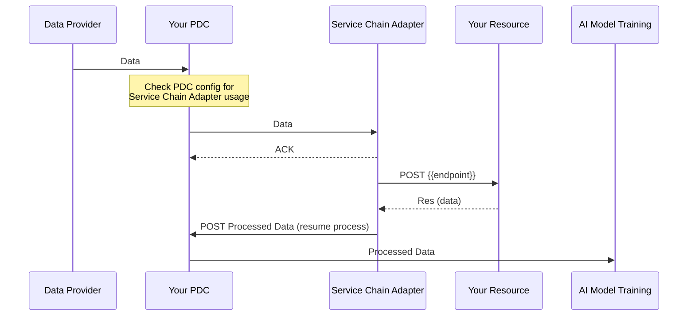

# Service chain adapter

The Service Chain Adapter is a component designed to facilitate the integration and management of service chains. 

It acts as an intermediary to let the service chain work synchronously without the need of implementation step for the participant to resume the node when not first or last node in a service chain.

## Configuration

The Service Chain Adapter can be configured **by Connector** so a participant can be part of multiple service chains and for all of them the service chain adapter will be used.

To configure the Service Chain Adapter for a specific Connector, you need to set the following properties in the Connector's configuration file:

```json
{
  "consentUri": "https://consent.com/v1/",
  "contractUri": "http:/contract.com/",
  "endpoint": "https://example.pdc.com/",
  "secretKey": "hmP5WG7vBFsj1fxNYWyzzO7zgczCBfkpfsu",
  "serviceKey": "Gr31PY4J2SRCPdqS5eaGQPEB1Bk5WnucLE",
  "catalogUri": "https://api.com/v1/",
  "serviceChainAdapter": true
}
```

> The field is optional and defaults to `false` if not specified.

## Usage

When the Service Chain Adapter is enabled for a Connector, it will automatically handle the necessary interactions with the service chain.

