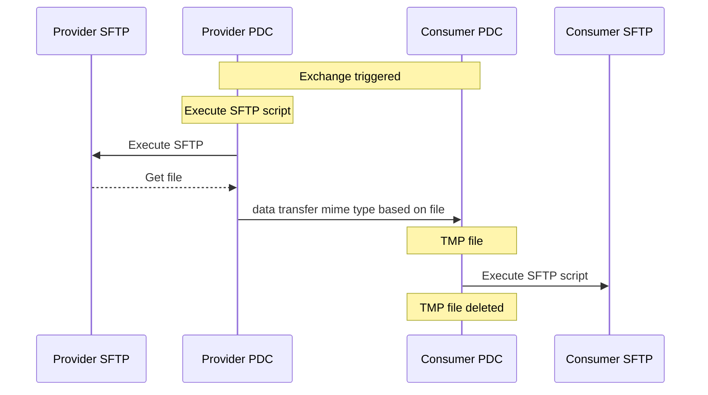
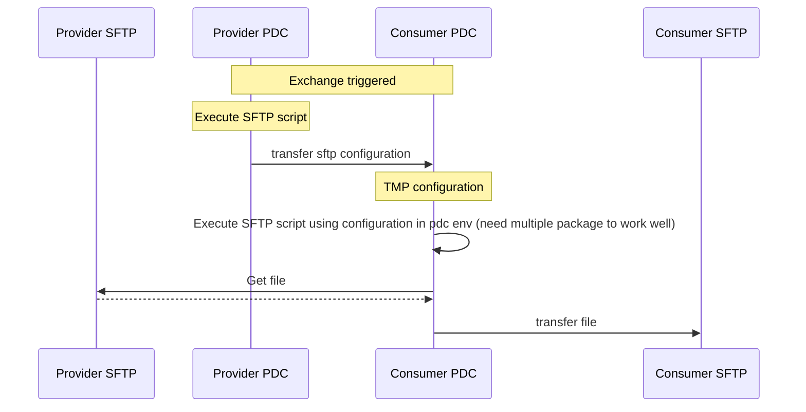
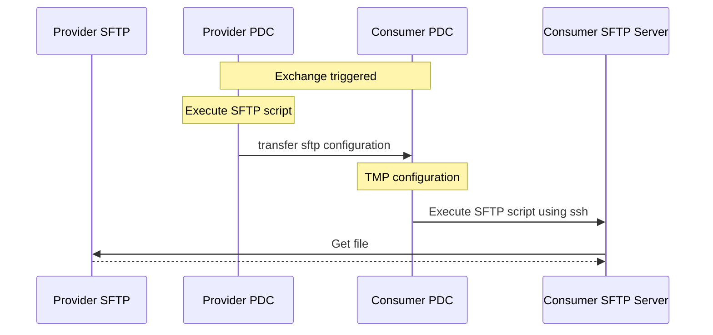

# FTP & SFTP

The workflows for enabling (S)FTP servers to exchange information after control-plane verification from the connector is a work in progress. The feature is currently **not implemented**. This document exists as an open reference to obtain community feedback.

