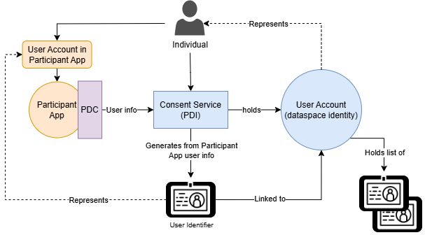
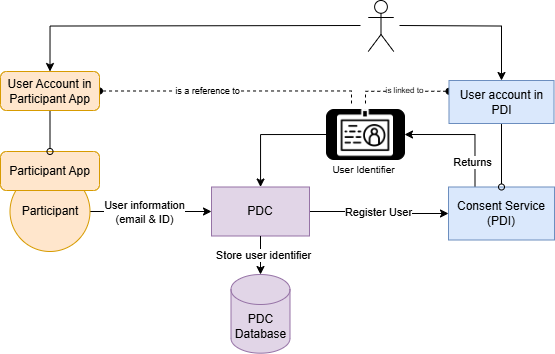

# User management for consent-driven data exchanges

When talking about Consent-Driven Data Exchanges, the question of user identity is a very important one. The Data Space connector needs to be able to reconciliate the identity of the user inside of the organisation's application/data source to the identity of the user that has granted the consent to share his data in order for the connector to push / pull the appropriate data for the right user in the data exchange flow.

## The Personal Data Intermediary

To understand user management, it is essential to understand what the Personal Data intermediary (PDI) is and what it represents for individuals. The PDI is an extension of the Consent manager building block, which acts as the user's "wallet" for handling and managing consents on data sharing across the data space.

As per how the internet works, individuals have an account in their PDI and accounts in the data and service provider applications. This account can be associated to different specificities of what the individual informed for his identity. Currently, the way the consent manager building block handles user identity is by considering the user email as the single source of truth for the user's identity.

An individual is free to provide any email he wishes to use to create accounts on different services, thus, potentially creating mismatches between his identity in service applications and his account in his PDI.
To fix this, the PDI has a model called the User Identifier that makes the association between the user's identity in the PDI and his identity in each and every service application that uses the consent management service. The consent manager has internal operations at several points of the flow to be able to associate user identifiers with different emails to the global user account in the PDI.

In essence, the PDI enables consent management from individuals and provides a solution for identity management for the different service applications connected to it.

## Management of user identifiers

As seen above, the PDI generates User Identifiers for every service application that is registered to the PDI for consent management. The role of the data space connector in all of this is to store the user identifiers of each and every user that exists in the service's application using the connector. This, in turn, enables the connector to reconciliate the identity from the consent to the identity of the service application to pull data from the correct user and push it to the right location.

The image below shows how these components interact and what they represent.



## Registering users to the PDI through the connector

> **Note**
>
> User registration is mandatory for all participant applications that work with end-user databases. However, for participant applications that propose services that are meant to work as APIs or do not handle user databases, it is not required and the [system handles this automatically](#consent-flows-for-user-management).

Registering users is a straightforward process and can be done easily through the connector. The only information needed by the consent service, and thus the connector, is the user's email and his internal ID from the application. This is what enables the connector to know how to provide to your application the correct email or ID when pushing and pulling data.



### Who should register their users ?

Participants who offer services or data that involve interaction with a user database are required to register their users through the connector. This is necessary as it is what enables the connector to be aware of who the individual is in the participant application during the data exchange flow.

### [Recommended] Providing the users through the admin API

Registering users through the connector's admin API enables direct integration and automation with existing applications. When registering through the admin API, it is simple to integrate the registration of the user to the PDI into any existing sign up flow to your application.

Integrating the user registration process through API allows to streamline the process for users as it reduces the risk for them to not have a user identifier for the said participant.

```bash
curl -X POST http://<connector-url>/private/users \
-H "Content-Type: application/json" \
-d '{
    "email": "<string>",
    "internalID": "<string>"
}'
```

### Providing a CSV file

The other way to handle user registration is by providing a CSV file of users, where their email and ID are informed. The connector will then handle registering all of the users to the consent service and store the generated user identifiers inside of its database.

#### Get the CSV Template

The connector is able to provide you with a csv template file to help you configure the CSV file you need to feed to the connector for it to manage the user registration.

```bash
curl -X POST http://<connector-url>/private/users/template \
    -H "Content-Type: application/json"
```

More information on the OpenAPI spec available at /docs after launching the connector

#### Post the users to the connector

After configuring the CSV file, feed the file to the connector to let it manage user registration.

```bash
curl -X POST http://<connector-url>/private/users/import \
    -H "Content-Type: multipart/form-data" \
    -F "file=@/path/to/your.csv"
```

More information on the OpenAPI spec available at /docs after launching the connector

## Consent flows for user management
This section takes a more in-depth look at the different cases that can occur for user management during the consent-driven data exchange flows.

### 1. The Data Consumer does not have a user database and the user is unknown in the Data Consumer

In this flow, all the steps are handled automatically by the consent service and the connectors, here's a breakdown of what happens behind the scenes.

1. Individual grants consent from the Data Provider or the PDI.
2. The consent service identifies that no user identifier is found on the Data Consumer's side.
3. The consent service identifies that the service from the data consumer is marked as not having a user database.
4. The consent service automatically creates a user identifier for the data consumer with the user email from the user identifier of the data provider.
5. The consent service communicates with the data consumer's connector to register the user identifier in the connector's database

### 2. The user has an account in the Data Consumer app with a different email then the one used in the Data Provider app.

In this flow, the system will attempt an account reconciliation to the individual's global PDI account, in most cases an email will be sent to the individual to validate this reconciliation and confirm the consent grant for the data exchange. The only requirement is that the individual informs the email he uses in the Data Consumer application through the consent popup.

1. Individual grants consent from Data Provider or PDI & provides the email he uses in the Data Consumer application.
2. The consent services finds the user identifier from the Data Consumer using the provided email.
3. An email is sent to the individual to validate the account reconciliation and consent grant.
4. The data exchange process is picked up and completed.

### 3. The user does not have an account in the Data Consumer app and needs to be registered

In some cases, individuals might grant their consent for data to be shared from a **Data Provider** to a **Data Consumer** inside of which they do not have an account and that has a user database.

For this flow, the system is ready to automate the process of registering users within the consumer application but it requires some added implementation to be done from the consumer participant. Let's start by breaking down the flow.

1. The individual grants consent from the Data Provider or PDI
2. The consent service identifies that there is no user identifier in the Data Consumer
3. The consent service pauses the data exchange and marks the consent as "draft"
4. The consent service would call the consumer connector and provide user information (email) on an endpoint of the connector that will proxy the request to the consumer application
    - This consumer application endpoint for user registration is what needs to be informed in the connector configuration for the `registrationUri` field.
    - The connector will POST on this endpoint with the following payload 
    ```json
    {
        "email": "",
        "consentId": "",
    }
    ```
    - The response to this endpoint MUST be in `application/json` and contain **one of** the following 4 fields in the response body that will represent the created user's ID
        * _id
        * id
        * userId
        * internalID
5. The connector is then able to automate the user registration to the consent service and re-trigger the continuation of the paused data exchange.

> Keep in mind that in order to make this flow possible, the Data Consumer **MUST** have registered their registrationUri in their connector configuration and made the implementation through this registrationUri possible for the connector to be able to POST to it.


***
### The aim for using wallets

As a side note, while currently not supporting wallets for user identity, one of the aims for the Data Space Connector is to support the use of wallets to facilitate the management of user identity across the data space.

---
\>\> [Personal Data Intermediary](./PDI.md)
